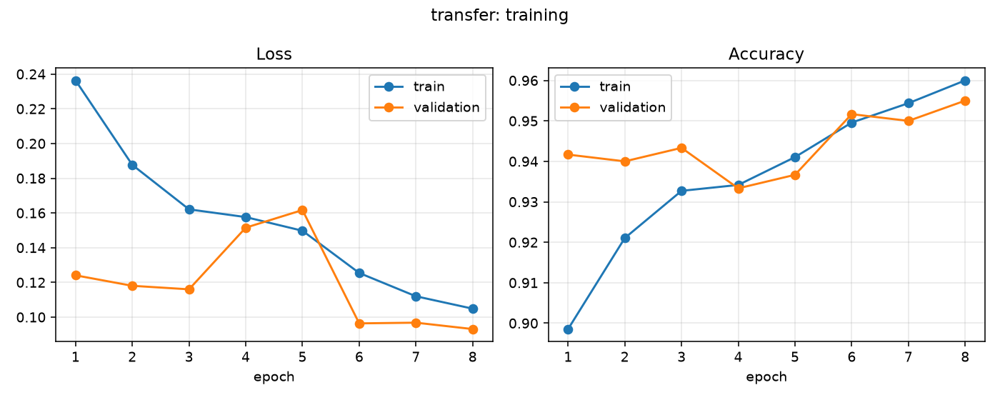
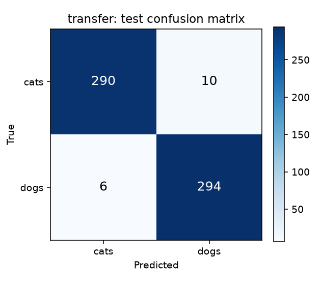

# Cats vs Dogs — End-to-End MLOps Pipeline

Binary image classification (cats vs dogs) for a pet adoption platform, built as a
complete MLOps pipeline: versioned data, tracked experiments, a containerized
inference service, CI that tests and publishes images, CD that deploys and
smoke-tests them, and monitoring of the live model.

**Course:** MLOps (S1-25_AIMLCZG523) · **Assignment 2** · BITS Pilani

---

## Pipeline at a glance

```
Kaggle Cats & Dogs (25,000 images)
   │  src/data/download.py            ← DVC stage 1
   ▼
data/raw/{cats,dogs}                  ← versioned with DVC
   │  src/data/preprocess.py          ← DVC stage 2: validate, 224×224 RGB, 80/10/10
   ▼
data/processed/{train,val,test}
   │  src/models/train.py             ← DVC stage 3: 3 models, tracked in MLflow
   ▼
models/model.pt (TorchScript) + metadata.json
   │  src/api/main.py                 ← FastAPI: /health, /predict, /metrics
   ▼
Docker image  ──CI──▶  ghcr.io/sahithisiripuram/mlops-assignment-02
   │                     (lint → pytest → build → smoke test → push)
   ▼
Kubernetes / Docker Compose  ──CD──▶  rollout + post-deploy smoke test
   │
   ▼
Monitoring: structured logs · Prometheus /metrics · /feedback → live accuracy
```

## Requirement → implementation map

| # | Requirement | Where it lives |
|---|---|---|
| **M1.1** | Git source versioning | This repository; feature-wise commit history |
| **M1.1** | DVC dataset versioning | [`dvc.yaml`](dvc.yaml), `.dvc/config`, `dvc.lock` — 3-stage pipeline |
| **M1.2** | Baseline model + serialization | [`src/models/architectures.py`](src/models/architectures.py); the selected model is exported to `models/model.pt` (TorchScript) + `models/model_state_dict.pt`, and every model — including the sklearn baseline — is logged to its MLflow run |
| **M1.3** | Experiment tracking | MLflow: [`src/models/train.py`](src/models/train.py) — params, per-epoch metrics, confusion matrix, ROC, loss curves |
| **M2.1** | REST inference service | [`src/api/main.py`](src/api/main.py) — FastAPI with `/health` + `/predict` (+ 5 more) |
| **M2.2** | Pinned dependencies | [`requirements.txt`](requirements.txt) (runtime), [`requirements-dev.txt`](requirements-dev.txt) (training/test) |
| **M2.3** | Containerization | [`Dockerfile`](Dockerfile) — multi-stage, non-root, healthcheck |
| **M3.1** | Automated tests | [`tests/`](tests) — 42 pytest tests over preprocessing, inference utils and the API |
| **M3.2** | CI pipeline | [`.github/workflows/ci.yml`](.github/workflows/ci.yml) — checkout → install → lint → test → build |
| **M3.3** | Artifact publishing | Same workflow pushes the image to GitHub Container Registry |
| **M4.1** | Deployment target | [`deployment/k8s/`](deployment/k8s) (Deployment + Service) and [`deployment/docker-compose.yml`](deployment/docker-compose.yml) |
| **M4.2** | CD / GitOps flow | [`.github/workflows/cd.yml`](.github/workflows/cd.yml) — pulls the published image, deploys on main, rolls back on failure |
| **M4.3** | Smoke tests | [`deployment/smoke_test.py`](deployment/smoke_test.py) — 12 checks; a failure fails the pipeline |
| **M5.1** | Monitoring & logging | [`src/api/monitoring.py`](src/api/monitoring.py) — JSON request logs, `/stats` counters, Prometheus `/metrics` |
| **M5.2** | Post-deployment tracking | [`scripts/monitor_performance.py`](scripts/monitor_performance.py) + `POST /feedback` → rolling live accuracy |

## Dataset

The Kaggle "Dogs vs Cats" dataset (25,000 labelled JPEGs), fetched from Microsoft's
official mirror of the same data so no Kaggle credentials are required. Set
`data.source: kaggle` in `params.yaml` to pull it through the Kaggle CLI instead.

Preprocessing (`src/data/preprocess.py`):

* validates every file and drops corrupt/zero-byte images (**2 were rejected**)
* samples 3,000 images per class (`preprocess.max_per_class`, set to `null` for all 25,000)
* converts to RGB and resizes to **224×224** for standard CNN input
* splits **80 / 10 / 10** into train / validation / test, deterministically (`seed: 42`)

| Split | Cats | Dogs | Total |
|---|---|---|---|
| Train | 2,400 | 2,400 | 4,800 |
| Validation | 300 | 300 | 600 |
| Test | 300 | 300 | 600 |

Training-time augmentation: random resized crop, horizontal flip, ±15° rotation and
colour jitter. Validation and test use a deterministic resize only.

## Results

Three models were trained and tracked as separate MLflow runs. Selection is by
**validation** accuracy; the table reports held-out **test** performance.

| Model | Val accuracy | Test accuracy | Precision | Recall | F1 | ROC-AUC | Train time |
|---|---|---|---|---|---|---|---|
| **MobileNetV3 transfer** (served) | **0.9550** | **0.9733** | 0.9671 | 0.9800 | **0.9735** | **0.9965** | 70 min |
| CNN from scratch | 0.6967 | 0.6433 | — | — | 0.6844 | 0.7551 | 14 min |
| Logistic regression on flattened pixels | 0.5883 | 0.5650 | — | — | 0.5429 | 0.5682 | 2 s |

The ordering is the expected one and is the point of the comparison: on 4,800
training images, a from-scratch CNN reaches only ~64% and raw-pixel logistic
regression barely beats chance, while a pre-trained backbone with a retrained head
reaches 97.3% test accuracy. The transfer model is therefore the one exported to
`models/model.pt` and baked into the container image.




On the 600-image test set the served model makes 16 mistakes: 10 cats classified as
dogs and 6 dogs classified as cats. Per-run plots for all three models (curves,
confusion matrices, ROC) are in [`docs/plots/`](docs/plots) and attached to their
MLflow runs.

## Quickstart

Requires Python 3.12+ and Docker.

```bash
make setup     # virtualenv + pinned dependencies
make data      # download + preprocess (80/10/10, 224x224)
make train     # baseline + CNN + transfer learning, tracked in MLflow
make test      # 42 unit tests
make serve     # API at http://localhost:8000/docs
```

Or reproduce the whole data→model path in one command:

```bash
dvc repro
```

### Experiment tracking

```bash
make mlflow    # MLflow UI at http://localhost:5000
```

Each run logs hyper-parameters, per-epoch train/validation loss and accuracy,
final test metrics, the confusion matrix, the ROC curve, loss/accuracy curves and
the serialized model.

## API

| Method | Endpoint | Purpose |
|---|---|---|
| GET | `/health` | Liveness/readiness — reports whether the model is loaded |
| GET | `/model` | Metadata of the served model (name, metrics, MLflow run id) |
| POST | `/predict` | Multipart image upload → label + class probabilities |
| POST | `/predict/base64` | Same, as JSON (handy in Postman) |
| POST | `/feedback` | Submit the true label for a prediction |
| GET | `/stats` | Request count, latency percentiles, class mix, live accuracy |
| GET | `/metrics` | Prometheus exposition |
| GET | `/docs` | Interactive OpenAPI documentation |

```bash
# health check
curl -s http://localhost:8000/health

# prediction
curl -s -X POST http://localhost:8000/predict \
  -F "file=@data/processed/test/dogs/dog_00001.jpg"
```

```json
{
  "request_id": "0f1c...",
  "label": "dogs",
  "confidence": 0.9987,
  "probabilities": {"cats": 0.0013, "dogs": 0.9987},
  "model_name": "transfer",
  "latency_ms": 41.2,
  "filename": "dog_00001.jpg"
}
```

## Container

```bash
make docker-build
make docker-run           # http://localhost:8000
make smoke                # post-deploy smoke test
make docker-stop
```

The image is multi-stage (build deps stay out of the runtime layer), runs as the
non-root `appuser`, ships CPU-only torch, and declares a `HEALTHCHECK` against
`/health`.

## Deployment

**Docker Compose** — inference service plus a Prometheus instance scraping `/metrics`:

```bash
make compose-up           # API :8000, Prometheus :9090
make smoke
make compose-down
```

**Kubernetes** (kind / minikube / microk8s):

```bash
kind create cluster --config deployment/k8s/kind-config.yaml
kind load docker-image cats-vs-dogs-inference:local
make k8s-deploy           # 2 replicas, rolling update, liveness/readiness/startup probes
make smoke BASE_URL=http://localhost:8080
```

## CI/CD

**CI** (`.github/workflows/ci.yml`) runs on every push and pull request:

1. checkout → install pinned dependencies
2. `ruff` lint
3. `pytest` with coverage (uploaded as a build artifact)
4. build the Docker image
5. run the container and execute the smoke test against it
6. push the verified image to `ghcr.io/sahithisiripuram/mlops-assignment-02`
   (tagged `latest`, the commit SHA, and the branch)

Only images that pass the smoke test are published.

**CD** (`.github/workflows/cd.yml`) is triggered by a successful CI run on `main`:

1. pull that exact image from GHCR
2. spin up a kind cluster and load the image
3. apply the Deployment + Service manifests, pinned to the published tag
4. wait for the rolling update to complete
5. run the post-deploy smoke test — **a failure fails the pipeline and rolls back**

## Monitoring

* **Structured logging** — every request emits one JSON line with request id, path,
  status, latency and prediction metadata. Image bytes are never logged.
* **Prometheus** — `inference_requests_total`, `inference_request_latency_seconds`,
  `model_predictions_total{label}`, `model_prediction_confidence`,
  `model_prediction_errors_total`, `model_live_accuracy`.
* **In-app counters** — `/stats` returns uptime, request/prediction counts, latency
  p50/p95, class balance and mean confidence without needing Prometheus.
* **Post-deployment accuracy** — `scripts/monitor_performance.py` replays held-out
  test images against the deployed service, posts the true labels to `/feedback`,
  and compares live accuracy with the offline test accuracy recorded at training time:

```bash
make monitor              # writes docs/monitoring_report.json
```

## Project structure

```
├── src/
│   ├── config.py                 # paths + params.yaml loader
│   ├── data/
│   │   ├── download.py           # DVC stage 1: fetch the dataset
│   │   ├── preprocess.py         # DVC stage 2: validate, resize, 80/10/10 split
│   │   └── datasets.py           # dataloaders + augmentation policy
│   ├── models/
│   │   ├── architectures.py      # SimpleCNN + MobileNetV3 transfer model
│   │   ├── train.py              # DVC stage 3: training + MLflow tracking
│   │   ├── evaluate.py           # metrics, confusion matrix, ROC, curves
│   │   └── serving.py            # Predictor used by the API and the tests
│   └── api/
│       ├── main.py               # FastAPI application
│       ├── monitoring.py         # logging, counters, Prometheus metrics
│       └── schemas.py            # request/response models
├── tests/                        # 42 pytest tests
├── deployment/
│   ├── docker-compose.yml        # inference + Prometheus
│   ├── prometheus.yml
│   ├── smoke_test.py             # post-deploy verification
│   └── k8s/                      # Deployment, Service, kind config
├── scripts/monitor_performance.py
├── .github/workflows/            # ci.yml, cd.yml
├── docs/                         # plots, leaderboard, monitoring report, screenshots
├── Dockerfile · Makefile · dvc.yaml · params.yaml
└── requirements.txt · requirements-dev.txt
```

## Reproducibility

* every hyper-parameter lives in `params.yaml`; nothing is hard-coded in the scripts
* fixed seeds for the split, the shuffling and the model initialization
* exact version pins for all ML libraries
* DVC records the data hashes; MLflow records params, metrics and the model per run
* `dvc repro` rebuilds the dataset and the model from scratch
